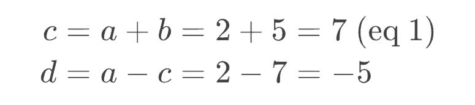

# Handcalcs

[](https://co1emi11er2.github.io/Handcalcs.jl/stable/)
[](https://co1emi11er2.github.io/Handcalcs.jl/dev/)
[](https://github.com/co1emi11er2/Handcalcs.jl/actions/workflows/CI.yml?query=branch%3Amaster)
[](https://ci.appveyor.com/project/co1emi11er2/Handcalcs-jl)
[](https://codecov.io/gh/co1emi11er2/Handcalcs.jl)
[](https://coveralls.io/github/co1emi11er2/Handcalcs.jl?branch=master)

## Introduction

This is a package for generating LaTeX maths and designed to improve documentation for your calculations. This package was designed to work in both jupyter and pluto.

This package supplies macros to generate ``\LaTeX`` formatted strings from mathmatical formulas. This package takes inspiration from [handcalcs.py](https://github.com/connorferster/handcalcs) which is a python package that works best in jupyter notebooks. The goal is to get the functionalities of that package and bring them to Julia. At this point, I believe most (if not all) of the features from the python package are here. The package integrates well with [Unitful.jl](https://painterqubits.github.io/Unitful.jl/stable/). This package is an extension of [Latexify.jl](https://github.com/korsbo/Latexify.jl). The `@latexdefine` macro is similar to the main `@handcalcs` macro, but instead of only a symbolic rendering it also renders the numeric substitution.

**Note: This package now renders properly in Quarto/Weave!! You can change the default settings to your liking. See [docs](https://co1emi11er2.github.io/Handcalcs.jl/stable/) for more info.**

## Basic Demo


*Note: In the gif, `@handfunc` is used for unrolling a function with algebraic expressions. It is now recommended to use the `@handcalcs` macro for this. See the [docs](https://co1emi11er2.github.io/Handcalcs.jl/stable/).*

## Basic example:

### Single line expression

```julia
using Handcalcs
a = 3
b = 4
@handcalcs c = sqrt(a^2 + b^2)
```

or

```julia
@handcalcs begin c = sqrt(a^2 + b^2) end
```

You may want to do the latter in Pluto. This will supress the assignment callout in the top left of the output cell.

This generates a LaTeXString (from
[LaTeXStrings.jl](https://github.com/stevengj/LaTeXStrings.jl)) which, when
printed looks like:

```LaTeX
$c = \sqrt{a^{2} + b^{2}} = \sqrt{3^{2} + 4^{2}} = 5.0$
```

And when this LaTeXString is displayed in an environment which supports the
tex/latex MIME type (Jupyter and Pluto notebooks, Jupyterlab and Hydrogen for
Atom) it will automatically render as:

[](image.png)

Also note `c` is evaluated as well.

### Multi line expression

You can add comments to the side of the expression by adding a string beside the expression. Note: the variables being assigned in the expressions are evaluated (see [docs](https://co1emi11er2.github.io/Handcalcs.jl/stable/) for more details). See example below.

```julia
a = 2
b = 5
@handcalcs begin 
    c = a + b; "eq 1";
    d = a - c
end
```

```LaTeX
$\begin{aligned}
c &= a + b = 2 + 5 = 7\;\text{  }(\text{eq 1})
\\[10pt]
d &= a - c = 2 - 7 = -5
\end{aligned}$
```

[](image.png)

### Function expression

This macro will generate LaTeX for a function that was called. The generated LaTeX would be the algebraic equations within the function.

```julia
b = 5
h = 15
@handcalcs Iy = calc_Ix(b, h) # calc_Ix is some function defined in another package
```

```LaTeX
$\begin{aligned}
Ix &= \frac{b \cdot h^{3}}{12} = \frac{5 \cdot 15^{3}}{12} = 1406.25
\end{aligned}$
```

[](image.png)

Note that `Iy` is evaluated (not`Ix`). Also note that return statements are filtered out of the function body, so keep relevant parts separate from return statements.

### Set default precision

Currently, to set the default precision, use the `set_default` function in combination with the [Format.jl](https://github.com/JuliaString/Format.jl) package. The `set_default` function is re-exported from the Latexify.jl package. See [here](https://korsbo.github.io/Latexify.jl/stable/#Setting-your-own-defaults) for more Latexify default settings. This is what I primarily use for now (you can see the use in the gif above):
```julia
using Format
set_default(fmt = x->format(round(x, digits=4)))
```

## Installation
This package is registered in the Julia registry, so to install it you can just
run:

```julia
Pkg.add("Handcalcs")
```

## Further information
For further information see the [docs](https://co1emi11er2.github.io/Handcalcs.jl/stable/)
